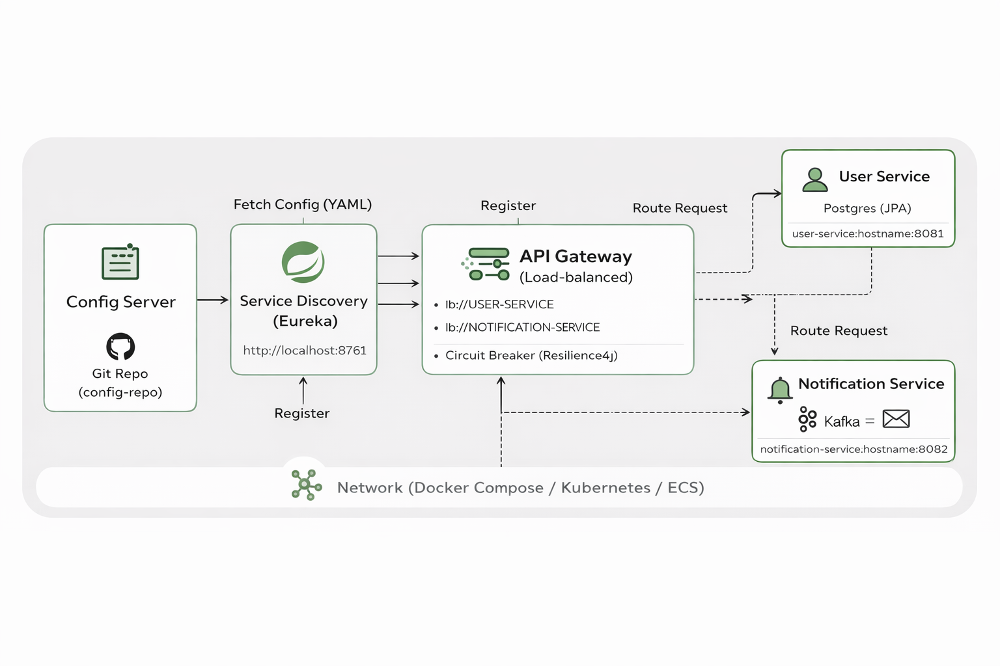

# itw-infra

**itw-infra** — инфраструктурный репозиторий для локальной разработки и тестирования микросервисной системы экосистемы **ITWizardry**.

Репозиторий содержит единый `docker-compose.system.yml`, который поднимает **полный dev-стек**: брокеры, БД и все ключевые Spring Cloud-компоненты.

Инфраструктура поднимается один раз и переиспользуется всеми сервисами.

---

## 🎯 Цель

- Развернуть всю микросервисную систему одной командой
- Отделить инфраструктуру от application-кода
- Получить production-like окружение для локальной разработки
- Упростить интеграционные тесты и демонстрации

---

## 📦 Состав системы

| Компонент | Назначение |
|---------|------------|
| **PostgreSQL** | Основная БД сервисов |
| **Kafka** | Брокер событий |
| **ZooKeeper** | Координация Kafka |
| **MailHog** | SMTP-сервер + Web UI |
| **Config Server** | External Configuration (Git-backed) |
| **Eureka** | Service Discovery |
| **API Gateway** | Edge-сервис, маршрутизация + Circuit Breaker |
| **user-service** | Основной бизнес-сервис |
| **notification-service** | Асинхронная обработка событий |

---

## 🧩 Архитектура

```

```

                ┌──────────────┐
                │  Config Repo │
                └──────┬───────┘
                       │
                ┌──────▼───────┐
                │ Config Server│
                └──────┬───────┘
                       │
    ┌──────────────────┼──────────────────┐
    │                  │                  │
```

┌───────▼────────┐  ┌──────▼────────┐  ┌──────▼────────┐
│ API Gateway     │  │ user-service  │  │ notification- │
│ (WebFlux + CB)  │  │               │  │ service       │
└───────┬────────┘  └──────┬────────┘  └──────┬────────┘
│                  │                  │
│            PostgreSQL          MailHog (SMTP)
│
└────────── Kafka (user.notifications)

````

Все сервисы регистрируются в **Eureka** и обмениваются конфигурацией через **Config Server**.

---

## ⚙️ Требования

- Docker
- Docker Compose v2

---

## 🚀 Быстрый старт

### 1. Подготовка окружения

Создать `.env` (файл не коммитится):

```bash
cp .env.example .env
````

Минимально необходимые переменные:

```env
GIT_USERNAME=your_github_username
GIT_TOKEN=your_github_token
```

---

### 2. Запуск системы

```bash
docker compose -f docker-compose.system.yml up -d --build
```

---

### 3. Проверка контейнеров

```bash
docker compose ps
```

Все сервисы должны быть в состоянии **Up / Healthy**.

---

## 🌐 Доступные сервисы

| Сервис        | Адрес                                          |
| ------------- | ---------------------------------------------- |
| Config Server | [http://localhost:8888](http://localhost:8888) |
| Eureka UI     | [http://localhost:8761](http://localhost:8761) |
| API Gateway   | [http://localhost:8080](http://localhost:8080) |
| MailHog UI    | [http://localhost:8025](http://localhost:8025) |
| PostgreSQL    | localhost:5432                                 |
| Kafka         | localhost:9092                                 |

---

## 🔍 Проверка Config Server

```bash
curl http://localhost:8888/user-service/default
curl http://localhost:8888/notification-service/default
curl http://localhost:8888/api-gateway/default
```

Ожидаемый результат — JSON с `propertySources`.

---

## 🧪 Проверка Eureka

Открыть в браузере:

```
http://localhost:8761
```

В списке должны быть:

* API-GATEWAY
* USER-SERVICE
* NOTIFICATION-SERVICE

Статус: **UP**

---

## 📬 Проверка асинхронного взаимодействия

1. Создать / удалить пользователя через API Gateway
2. `user-service` публикует событие в Kafka
3. `notification-service` получает событие
4. Письмо отображается в **MailHog UI**

---

## 🧠 Важные детали реализации

### Kafka

```properties
spring.kafka.bootstrap-servers=kafka:29092
```

### PostgreSQL

```properties
jdbc:postgresql://itw-postgres:5432/user_service
```

### SMTP (MailHog)

```properties
spring.mail.host=mailhog
spring.mail.port=1025
```

---

## ❤️ Healthcheck ZooKeeper

В образе `confluentinc/cp-zookeeper` 4LW-команды могут быть ограничены,
поэтому healthcheck реализован через проверку TCP-порта `2181`.

Это стабильный вариант для dev-среды.

---

## 🔐 Безопасность

* GitHub token **не хранится в репозитории**
* Используется `.env`
* Рекомендуется периодическая ротация токенов

---

## 🧪 Среда использования

Подходит для:

* локальной разработки
* интеграционных тестов
* демонстрации архитектуры

❗ Не предназначено для production без доработок.

---

## 🗺 Roadmap

* [ ] Kafka UI
* [ ] Observability (Prometheus + Grafana)
* [ ] Profiles: dev / test
* [ ] CI/CD bootstrap

---

## 👤 Автор

**Mikhail Latypov**
GitHub: [https://github.com/hodkonem](https://github.com/hodkonem)

```
